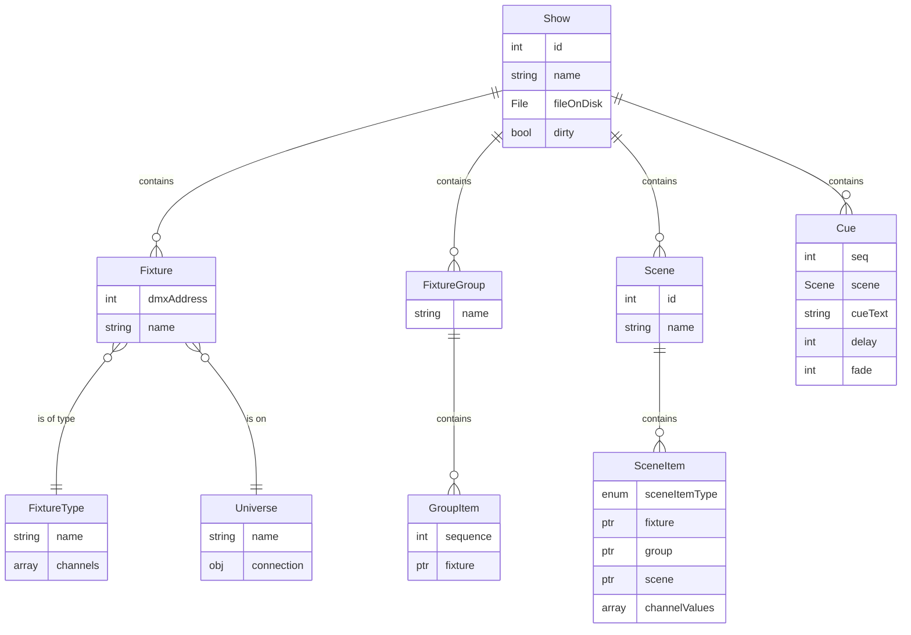

# Class Diagram

Class Diagram for main Footlight structures

```mermaid
erDiagram

Show {
    int id
    string name
    File fileOnDisk
    bool dirty
}


Show ||--o{ Fixture : contains

Fixture {
    int dmxAddress
    string name
}

Fixture }o--|| FixtureType : "is of type"
FixtureType {
    string name
    array channels
}

Fixture }o--|| Universe : "is on"
Universe {
    string name
    obj connection
}


Show ||--o{ FixtureGroup : contains

FixtureGroup {
    string name
}


FixtureGroup ||--o{ GroupItem : contains
GroupItem {
    int sequence
    ptr fixture
}


Show ||--o{ Scene : contains
Scene {
    int id
    string name
}

Scene ||--o{ SceneItem : "contains"
SceneItem {
    enum sceneItemType
    ptr fixture
    ptr group
    ptr scene
    array channelValues
}


Show ||--o{ Cue : contains
Cue {
    int seq
    Scene scene
    string cueText
    int delay
    int fade
}

```
