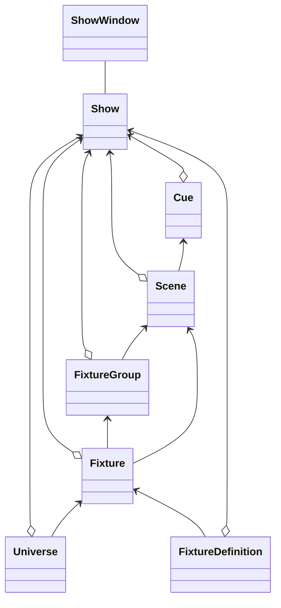

# Class Diagram

Class Diagram for main Footlight structures

## Aggregation

"has a", eg a show "Has a" scene. Hollow diamond on a solid line. Diamond is on containing item's end of the line.

## Association

Links from one to another. Uses a solid line. Can have an open triangle / arrow at one end.

