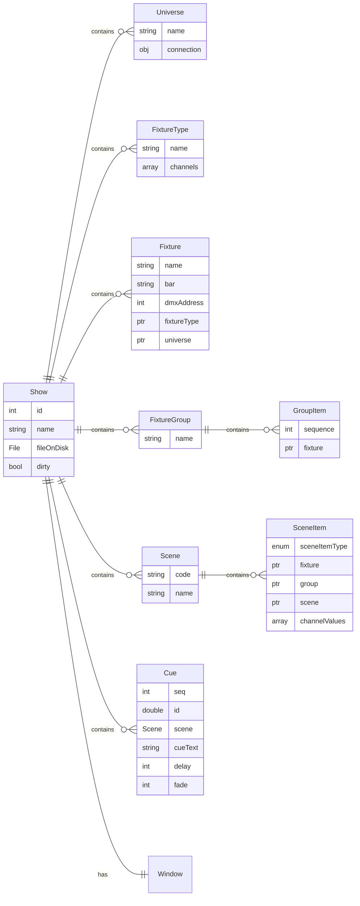

# Ownership Diagram

Object Ownership Diagram for main Footlight structures

```mermaid
erDiagram
    direction LR

Show {
    int id
    string name
    File fileOnDisk
    bool dirty
}

Show ||--o{ Universe : contains
Universe {
    string name
    obj connection
}

Show ||--o{ FixtureType : contains
FixtureType {
    string name
    array channels
}

Show ||--o{ Fixture : contains
Fixture {
    string name
    string bar
    int dmxAddress
    ptr fixtureType
    ptr universe
}

Show ||--o{ FixtureGroup : contains
FixtureGroup {
    string name
}
FixtureGroup ||--o{ GroupItem : contains
GroupItem {
    int sequence
    ptr fixture
}

Show ||--o{ Scene : contains
Scene {
    string code
    string name
}
Scene ||--o{ SceneItem : "contains"
SceneItem {
    enum sceneItemType
    ptr fixture
    ptr group
    ptr scene
    array channelValues
}

Show ||--o{ Cue : contains
Cue {
    int seq
    double id
    Scene scene
    string cueText
    int delay
    int fade
}

Show ||--|| Window : has
```
